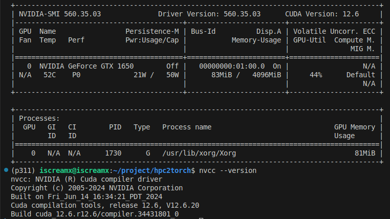
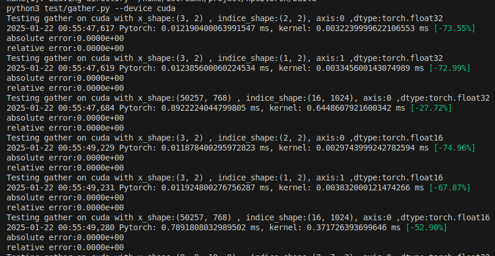
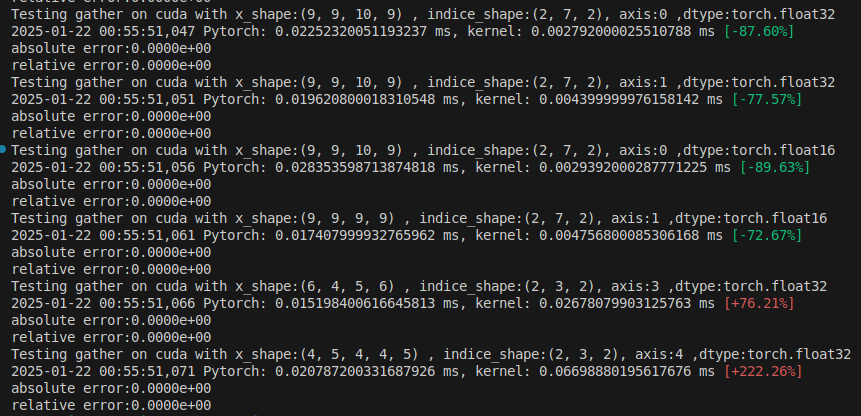

# 2024 冬季 CUDA 作业

## 作业内容
基于 [hpc2torch](https://github.com/YdrMaster/hpc2torch) 实现 ONNX gather 算子的 CUDA 版本。

## 实验
测试环境是 GTX 1650:

性能测试:

多维度测试(不支持axis为负数):

## 代码修改
- [gather_cuda.cu](./src/gather/gpu/gather_cuda.cu): 实现 gather kernel
- [gather.py](./test/gather.py): 加了一些辅助函数方便测试
- [matmul_cuda.cu](./src/matmul/gpu/matmul_cuda.cu): 1650不支持TF32, 注释掉不然编译报错
- [CMakeLists.txt](./CMakeLists.txt): 1650 是Turing架构, 修改 `CUDA_ARCHITECTURES 80` 为 `75`

